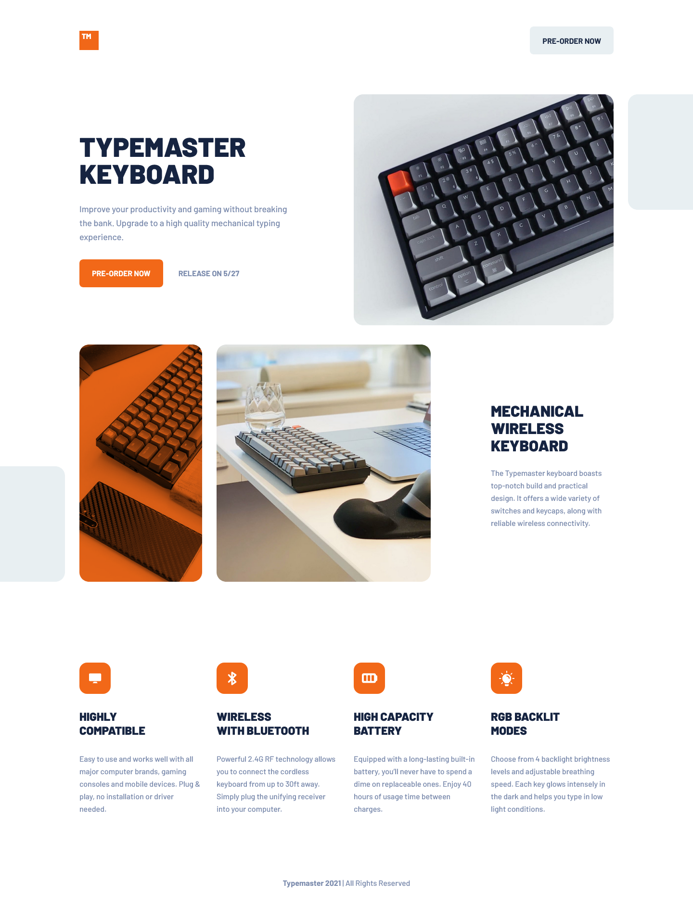
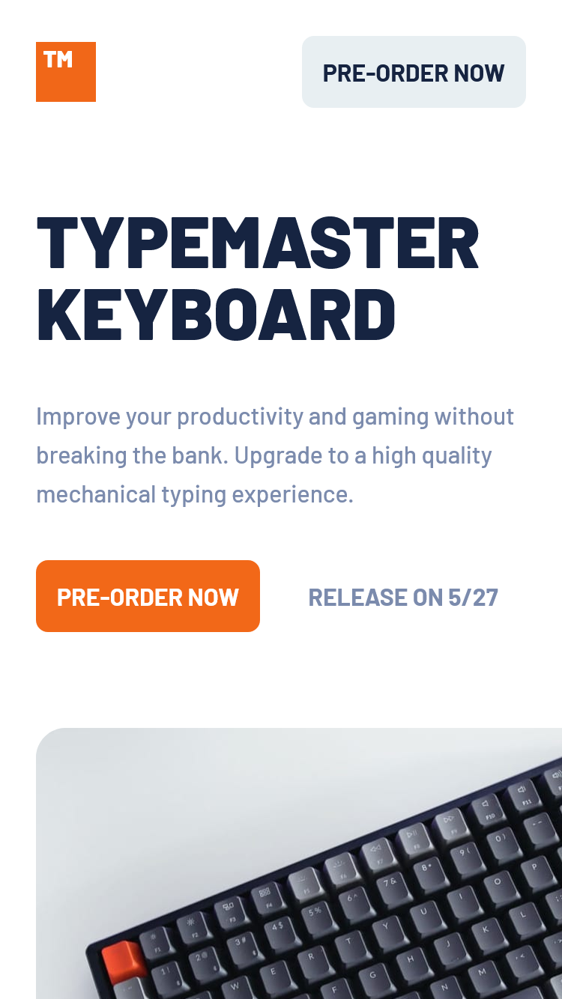

# Frontend Mentor - Typemaster pre-launch landing page solution

This is a solution to the [Typemaster pre-launch landing page challenge on Frontend Mentor](). Frontend Mentor challenges help you improve your coding skills by building realistic projects.

## Table of contents

- [Frontend Mentor - Typemaster pre-launch landing page solution](#frontend-mentor---typemaster-pre-launch-landing-page-solution)
  - [Table of contents](#table-of-contents)
  - [Overview](#overview)
    - [The challenge](#the-challenge)
    - [Screenshot](#screenshot)
    - [Links](#links)
  - [My process](#my-process)
    - [Built with](#built-with)
  - [Author](#author)

## Overview

### The challenge

Users should be able to:

- View the optimal layout depending on their device's screen size
- See hover states for interactive elements

### Screenshot

Desktop

Mobile

### Links

- Solution URL: [Solution](https://www.frontendmentor.io/solutions/responsive-landing-page-using-css-grid-and-sass-HySIlqZ4c#comment-625414c7f223eb5a9912c308)
- Live Site URL: [Live Site](https://abedfetrat.github.io/fem05-typemaster-pre-launch-landing-page/)

## My process

### Built with

- Semantic HTML5 markup
- CSS custom properties
- Flexbox
- CSS Grid
- Mobile-first workflow
- SCSS / SASS

## Author

- Frontend Mentor - [@abedfetrat](https://www.frontendmentor.io/profile/abedfetrat)
- LinkedIn - [@abedfetrat](https://www.linkedin.com/in/abed-fetrat-84728717a?lipi=urn%3Ali%3Apage%3Ad_flagship3_profile_view_base_contact_details%3BUKdPHQu3Qm%2B6krqAb0fxCw%3D%3D)